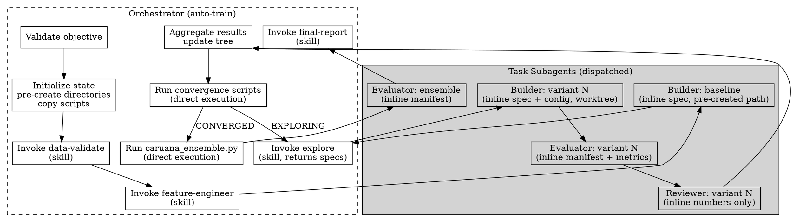

<!-- design-region-clean-of-hard-gates -->

# Auto Train

<HARD-GATE>
Do NOT begin training without a structured objective YAML containing dataset.train, dataset.test, target_column, competition.metric, competition.metric_direction, submission_format.id_column, and submission_format.prediction_column. STOP and ask the user to provide missing fields.
</HARD-GATE>

<HARD-GATE>
Do NOT begin training without a git repository. NEVER proceed if `git rev-parse --git-dir` fails.
</HARD-GATE>

<HARD-GATE>
Do NOT dispatch a builder subagent without pre-creating its worktree directory and inlining the fully-resolved config. STOP and resolve the config first.
</HARD-GATE>

<HARD-GATE>
Do NOT accept a subagent's return without verifying output artifacts exist on disk. STOP and check file existence before proceeding.
</HARD-GATE>

## Anti-Pattern

**"Let me invoke the build-variant skill and let it figure out the details"** -- auto-train dispatches narrow-scope Task subagents with inline context. Each subagent receives exactly the data it needs, writes to a pre-created path, and returns a measured verdict.

## Core Principle

One orchestrator dispatches narrow-scope subagents with inline context at every drift-prone boundary, validates their output, and runs provided scripts directly.

## Process Flow



## Checklist

1. Validate the objective YAML for all required fields
2. Initialize .auto-trainer/ state, pre-create directories, copy scripts, register Stop hook
3. Invoke data-validate on the training and test datasets (skill)
4. Invoke feature-engineer to research and lock the feature set (skill)
5. Dispatch the baseline builder subagent and validate its artifacts
6. Validate the baseline output and add the root node to the tree
7. Invoke explore to generate the following variant batch (skill)
8. Run the exploration loop: dispatch builders, validate, dispatch evaluators, validate, dispatch reviewers, validate, aggregate, run convergence scripts
9. Run caruana_ensemble.py directly to blend the Pareto front
10. Dispatch the ensemble evaluator subagent and validate its output
11. Compare the ensemble against the best single model and record the winner
12. Invoke final-report when CONVERGED (skill)
13. Offer cleanup after the human reviews the report
14. Resume flow recovers state and re-enters the loop

## Step Details

### 1. Validate Objective YAML

Parse the objective YAML. Verify all required fields are present:

```
dataset:
  train: path/to/train.csv
  test: path/to/test.csv
target_column: target
competition:
  metric: roc_auc
  metric_direction: maximize
submission_format:
  id_column: id
  prediction_column: prediction
```

If any field is missing, return NEEDS_CONTEXT with the list of missing fields.

### 2. Initialize State

```
mkdir -p .auto-trainer/worktrees
mkdir -p .auto-trainer/scripts
cp scripts/*.py .auto-trainer/scripts/
cp scripts/*.sh .auto-trainer/scripts/
chmod +x .auto-trainer/scripts/*.sh
```

Write .auto-trainer/convergence-config.json:

```json
{
  "architecture_classes_minimum": 3,
  "pareto_stability_rounds": 2,
  "max_depth": 3
}
```

Write .auto-trainer/experiment-tree.json with the initial structure:

```json
{
  "primary_metric_key": "<from objective>",
  "metric_direction": "<from objective>",
  "nodes": {},
  "pareto_front": [],
  "pareto_history": [],
  "class_status": {}
}
```

Register the Stop hook in .claude/settings.local.json as a safety net:

```json
{
  "hooks": {
    "Stop": [
      {
        "matcher": "",
        "hooks": [
          {
            "type": "command",
            "command": "bash .auto-trainer/scripts/check_convergence.sh",
            "timeout": 30000
          }
        ]
      }
    ]
  }
}
```

The hook fires only if a stop attempt slips through before convergence. The primary loop driver is the exploration loop in step 8.

### 3. Data Validation

Invoke the data-validate skill with the objective's dataset paths and target column. If data-validate returns BLOCKED, propagate the block.

### 4. Feature Engineering

After data-validate returns DONE, invoke the feature-engineer skill. Wait for DONE, DONE_WITH_CONCERNS, or BLOCKED. DONE or DONE_WITH_CONCERNS means features.py and feature-manifest.json are locked at `.auto-trainer/`. BLOCKED propagates.

### 5. Dispatch Baseline Builder

Pre-create the baseline worktree before dispatch:

```
mkdir -p .auto-trainer/worktrees/exp_000/
```

Resolve the baseline config (minimal model, default hyperparameters). Dispatch a Task subagent with inline context:

```json
{
  "variant_spec": {"parent_id": null, "architecture_class": "linear", "config_delta": {}, "hypothesis": "establish the floor metric"},
  "resolved_config": {"model_type": "logistic_regression", "...": "..."},
  "worktree_path": ".auto-trainer/worktrees/exp_000/",
  "objective": {"metric": "<key>", "direction": "<dir>", "target_column": "<col>"},
  "features_path": ".auto-trainer/features.py",
  "constraints_hash": "<sha>"
}
```

Instruct the subagent to build exactly the required modules at the given path and write BUILD_REPORT.md. Use isolation worktree.

### 6. Validate Baseline

Verify all required files exist at the worktree path. Verify constraints.lock SHA matches the objective. If verification fails, dispatch a repair builder with the missing-file list inline. Add the baseline as the root node at depth 0 once artifacts pass. The baseline metric becomes the floor that all variants must beat.

### 7. Invoke Explore

Invoke the explore skill. It reads the experiment tree and Pareto front and returns a JSON array of variant specs, prioritizing untried architecture classes for mandatory divergence.

### 8. Exploration Loop

Run the loop entirely within the current turn. For each round, process the variant specs returned by explore:

1. For each variant spec: compute its SHA, run `mkdir -p .auto-trainer/worktrees/<sha>/`, resolve the config by walking the parent chain, then dispatch a builder Task subagent with the spec, resolved config, worktree path, objective, features path, and constraints hash inline. Use isolation worktree.
2. After each builder returns: verify the required modules exist and constraints.lock SHA matches. Block the variant if files are missing.
3. For each built variant: read metrics_manifest.json from the worktree, pre-create EVALUATION.json, then dispatch an evaluator Task subagent with the worktree path, manifest contents, baseline metrics, metric key, direction, and significance threshold inline.
4. After each evaluator returns: verify EVALUATION.json exists, the verdict is one of ACCEPT, REJECT, INCONCLUSIVE, or CRASHED, and the metrics are numeric.
5. For each ACCEPT variant: read trainable_params from BUILD_REPORT.md and the baseline params from the tree, pre-create REVIEW.json, then dispatch a reviewer Task subagent with the evaluation result, variant params, baseline params, experiment history, and complexity thresholds inline.
6. After each reviewer returns: verify REVIEW.json exists and the verdict is one of KEEP, DISCARD, or KEEP_WITH_CONCERNS.
7. Aggregate all verdicts into experiment-tree.json. Append the round summary to progress.txt.
8. Run the convergence scripts directly: `python3 .auto-trainer/scripts/compute_pareto.py`, then `python3 .auto-trainer/scripts/check_class_exhaustion.py`, then `python3 .auto-trainer/scripts/check_cross_class_coverage.py`, all reading and writing experiment-tree.json.
9. Read global_status from experiment-tree.json. If EXPLORING, invoke explore again for the following batch and return to substep 1. If CONVERGED, exit the loop.

Do NOT end the turn between rounds. Do NOT yield to the Stop hook. Run rounds sequentially until CONVERGED.

### 9. Run Caruana Ensemble

Collect all ACCEPTED variant worktree paths from the experiment tree. Verify val_predictions.npy and val_labels.npy exist in each. Pre-create the ensemble worktree:

```
mkdir -p .auto-trainer/worktrees/exp_ensemble/
```

Run the provided script directly:

```bash
python3 .auto-trainer/scripts/caruana_ensemble.py \
  .auto-trainer/experiment-tree.json \
  <metric_key> <metric_direction> \
  .auto-trainer/worktrees/exp_ensemble/ensemble_config.json
```

Read ensemble_config.json. If SKIPPED, proceed to final-report.

### 10. Dispatch Ensemble Evaluator

If the script produced DONE, pre-create the ensemble EVALUATION.json and dispatch an evaluator Task subagent on the ensemble worktree with the metrics manifest inline, exactly as in step 8. Validate the returned EVALUATION.json.

### 11. Compare and Record Winner

Compare the ensemble metric against the best single model. Record the winner in experiment-tree.json.

### 12. Final Report

Once global_status is CONVERGED:

- Invoke the final-report skill to produce the evidence-based report and Kaggle submission
- final-report writes .auto-trainer/final-report.md and .auto-trainer/submission.csv
- The stop attempt succeeds because check_convergence.sh sees final-report.md exists and exits cleanly

### 13. Cleanup

After the final report is delivered and the human has reviewed it:

- Offer to remove the Stop hook from .claude/settings.local.json
- Keep the worktrees and experiment tree intact for reproducibility
- The .auto-trainer directory is the permanent record of the exploration

### 14. Resume Flow

When the user runs `/auto-train --resume`:

- Read .auto-trainer/experiment-tree.json to recover the current state
- Verify the Stop hook is registered in .claude/settings.local.json; if missing, re-register it
- Read .auto-trainer/progress.txt for the last completed action
- Re-enter the exploration loop wherever the pipeline left off: if mid-exploration, dispatch the pending builders, evaluators, or reviewers; if converged but no report, invoke final-report

## Gate Functions

- BEFORE beginning training: "Does the objective YAML contain all seven required fields?"
- BEFORE registering the Stop hook: "Is this a git repository with `git rev-parse --git-dir` succeeding?"
- BEFORE dispatching a builder: "Did I pre-create the worktree directory and resolve the full config inline?"
- BEFORE dispatching an evaluator: "Did I read the metrics manifest and pre-create EVALUATION.json?"
- BEFORE dispatching a reviewer: "Did I gather every param count and threshold to pass inline?"
- BEFORE running caruana_ensemble.py: "Do val_predictions.npy and val_labels.npy exist in every accepted worktree?"
- BEFORE accepting any subagent return: "Do the expected artifacts exist on disk with a valid verdict?"
- BEFORE running the convergence scripts: "Did I aggregate every verdict into the experiment tree?"

## Rationalization Table

| You think... | Reality |
|---|---|
| Let me invoke build-variant as a skill and let it sort out the path | Create the worktree, resolve the config, dispatch a builder subagent, then verify the files. |
| The subagent can find the metrics manifest itself | Read the manifest and pass its contents inline so the subagent never searches |
| I can write a faster blend than the provided script | Run caruana_ensemble.py directly; a custom blend breaks the audit trail |
| I already know the convergence status | Run the convergence scripts and read global_status from the tree |
| The reviewer can read the model code for param counts | Pass trainable_params inline; the reviewer gets numbers, not model files |

## Red Flags

- "let me invoke build-variant as a skill"
- "the subagent can find the config"
- "I can write a faster blend"
- "I already know convergence status"
- "this looks good enough"
- "skipping validation since the data looks clean"

## Key Principles

- One orchestrator dispatches narrow-scope subagents and validates every return
- Builders, evaluators, and reviewers receive inline context and never read shared state files
- Each subagent writes to a pre-created path and cannot invent its own directory
- The orchestrator runs caruana_ensemble.py and the convergence scripts directly
- Data validation runs on every invocation, not just the first
- The baseline establishes the floor that all variants must beat
- The Stop hook is a safety net that catches a premature stop, not the primary loop driver
- The .auto-trainer directory is the permanent audit trail

## The Bottom Line

```bash
echo "VERDICT: validate objective, dispatch narrow-scope subagents with inline context, validate every artifact, run convergence and ensemble scripts directly until CONVERGED, then produce final report -- DONE or BLOCKED"
```

## Status Vocabulary

- **DONE** -- full pipeline complete, winner identified, report and submission delivered
- **DONE_WITH_CONCERNS** -- complete but final-report flagged integrity or coverage concerns
- **BLOCKED** -- cannot proceed (no data, no git repo, data validation failed, unfixable error)
- **NEEDS_CONTEXT** -- objective YAML is missing required fields
- **EXPLORING** -- experiment tree is actively being expanded within the exploration loop
- **CONVERGED** -- two-tier convergence passed, final report pending or delivered
