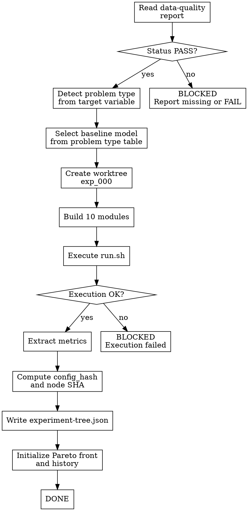

<!-- design-region-clean-of-hard-gates -->

# Baseline

<HARD-GATE>
Do NOT establish a baseline without a PASS data-quality report. STOP and read `.auto-trainer/data-quality-report.json` first; if the file does not exist or status is not `"PASS"`, emit BLOCKED.
</HARD-GATE>

<HARD-GATE>
Do NOT use a complex model as the starting point unless every simpler alternative has been ruled out by data constraints. NEVER skip the interpretable baseline -- it sets a floor, not a competitor.
</HARD-GATE>

## Anti-Pattern

**"Let's start with a good model"** -- the baseline is not meant to be good. It is meant to be simple, fast, and interpretable. Starting with a "good" model poisons the experiment tree because there is no floor to measure improvement against.

## Core Principle

The baseline is the simplest interpretable model for the detected problem type, establishing the performance floor every subsequent experiment must beat.

## Process Flow



## Checklist

1. Verify the data-quality report
2. Detect the problem type
3. Select the baseline model
4. Create the worktree
5. Build the 10 modules
6. Execute run.sh
7. Extract metrics
8. Compute config_hash and node SHA
9. Write experiment-tree.json
10. Initialize Pareto front and history

## Step Details

### 1. Verify the data-quality report

Read `.auto-trainer/data-quality-report.json` and verify `status` is `"PASS"`. If the file does not exist or status is not PASS, emit BLOCKED and stop.

### 2. Detect the problem type

Read the target variable section from the data-quality report. Determine the problem type using the detection table. Record the detected type in the experiment config.

| Target Characteristic | Problem Type | Baseline Model |
|---|---|---|
| Continuous numeric (float, high cardinality) | Regression | Ridge (alpha=1.0) |
| Categorical with 2 classes | Binary classification | LogisticRegression (C=1.0) |
| Categorical with 3-20 classes | Multiclass classification | LogisticRegression (multi_class=multinomial, C=1.0) |
| Categorical with > 20 classes | High-cardinality classification | LogisticRegression (multi_class=multinomial, C=1.0) |
| Ordered numeric (relevance scores, ratings) | Ranking | Linear model on relevance scores |

### 3. Select the baseline model

Select the model from the problem type detection table. No hyperparameter search. Use the default values specified in the table. Record the model class and parameters in the experiment config.

### 4. Create the worktree

Create the baseline worktree at `.auto-trainer/worktrees/exp_000/`. This is the root of the experiment tree. Initialize the directory structure:

```
.auto-trainer/worktrees/exp_000/
    config.py
    data.py
    model.py
    train.py
    eval.py
    preflight.py
    run.sh
    metrics_manifest.json
    constraints.lock
    BUILD_REPORT.md
```

### 5. Build the 10 modules

Build each module in the worktree, matching the build-variant 10-module structure:

1. **config.py** -- model class, hyperparameters, dataset paths, target column, metric, random seed (all tunable values here)
2. **data.py** -- load data, apply mitigations from data-quality report, split train/validation, enforce feature whitelist. data.py imports and applies .auto-trainer/features.py to raw data before splitting. If features.py does not exist (feature-engineer returned BLOCKED), data.py operates on raw data.
3. **model.py** -- instantiate the baseline model with fixed hyperparameters (architecture only, no training logic)
4. **train.py** -- fit the model on the training split (training loop only)
5. **eval.py** -- compute the primary metric and secondary metrics, write results to metrics output, generate test predictions in submission format
6. **preflight.py** -- verify constraints.lock SHA, check imports, validate config
7. **run.sh** -- sequential execution: `set -euo pipefail`, preflight, train, eval
8. **metrics_manifest.json** -- metric names, output path, extraction command (machine-readable)
9. **constraints.lock** -- byte-copy of objective integrity section with SHA-256
10. **BUILD_REPORT.md** -- one-paragraph description of the baseline experiment, `trainable_params: <int>` as machine-readable field

### 6. Execute run.sh

Run the baseline experiment by executing `bash run.sh` in the worktree directory. Capture stdout and stderr. If execution fails, emit BLOCKED with the error output.

### 7. Extract metrics

Read `metrics_manifest.json` from the worktree. Execute the extraction command declared in the manifest to produce the metrics output. Extract the primary metric value and all secondary metrics. Verify the primary metric key matches what the objective file specifies.

### 8. Compute config_hash and node SHA

Compute `config_hash` as the SHA-256 of the canonical serialization of `config.py` contents. The baseline is the root node, so the node `sha` is `SHA-256(config_hash + "root")` — specifically `hashlib.sha256(f"{config_hash}+root".encode()).hexdigest()`. For all subsequent nodes, the formula is `SHA-256(config_hash + parent_sha)`.

### 9. Write experiment-tree.json

Create `.auto-trainer/experiment-tree.json` with the baseline as the sole node:

```json
{
  "primary_metric_key": "rmse",
  "metric_direction": "minimize",
  "nodes": {
    "exp_000": {
      "exp_id": "exp_000",
      "parent": null,
      "depth": 0,
      "architecture_class": "linear",
      "model": "Ridge",
      "config_hash": "a1b2c3...",
      "sha": "d4e5f6...",
      "status": "DONE",
      "metrics": {
        "rmse": 29456.78,
        "mae": 19234.12,
        "r2": 0.82
      },
      "trainable_params": 81,
      "worktree_path": ".auto-trainer/worktrees/exp_000/"
    }
  },
  "pareto_front": ["exp_000"],
  "pareto_history": [["exp_000"]],
  "class_status": {
    "linear": {
      "status": "EXPLORING",
      "best": 29456.78,
      "depth": 0
    }
  },
  "global_status": "EXPLORING"
}
```

### 10. Initialize Pareto front and history

The baseline is the only node, so it is trivially on the Pareto front. Set `pareto_front` to `["exp_000"]` and `pareto_history` to `[["exp_000"]]`. These arrays are updated by `compute_pareto.py` and `check_cross_class_coverage.py` after each subsequent exploration round.

## Gate Functions

- BEFORE selecting a model: "Has the problem type been detected from the data-quality report target variable section?"
- BEFORE executing run.sh: "Are all 10 modules written to the worktree with correct paths and dependencies?"
- BEFORE writing experiment-tree.json: "Did run.sh complete without errors and produce a valid metrics.json?"
- BEFORE emitting DONE: "Does experiment-tree.json contain the baseline node with valid hashes, metrics, and initialized Pareto front?"

## Rationalization Table

| You think... | Reality |
|---|---|
| "A tree model would give a better starting point" | Use the simplest interpretable model from the problem type table |
| "I can skip the worktree and just run the model inline" | Create the full worktree with all 10 modules for reproducibility |
| "The metrics look reasonable from the logs" | Run the metric extraction from metrics.json programmatically |
| "I'll initialize the experiment tree later" | Write experiment-tree.json immediately after metric extraction |

## Red Flags

- "A simple model is a waste of time"
- "I already know which model will win"
- "The baseline is just a formality"
- "I can estimate the baseline performance"

## Key Principles

- The baseline is always the simplest interpretable model for the detected problem type
- No hyperparameter search in the baseline -- use fixed defaults from the table
- Every experiment lives in its own worktree with a complete module set
- The node SHA chains config_hash to parent_node_hash forming a Merkle-like lineage
- The Pareto front is initialized with the baseline as the sole member

## The Bottom Line

```bash
STATUS=$(python3 -c "
import json, sys
with open('.auto-trainer/experiment-tree.json') as f:
    tree = json.load(f)
node = tree['nodes'].get('exp_000', {})
has_metrics = bool(node.get('metrics'))
has_hash = bool(node.get('node_hash'))
on_pareto = 'exp_000' in tree.get('pareto_front', [])
print('PASS' if has_metrics and has_hash and on_pareto else 'FAIL')
")
echo "VERDICT: $STATUS"
```

## Status Vocabulary

- **DONE** -- baseline established, experiment tree initialized, Pareto front seeded
- **BLOCKED** -- data-quality report missing or not PASS, or baseline execution failed
