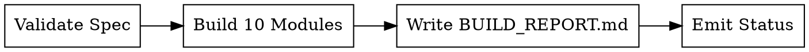

<!-- design-region-clean-of-hard-gates -->

# Build Variant

<HARD-GATE>
Do NOT read experiment-tree.json or any shared state file unless the dispatch prompt names it. STOP and use only the inline context from the dispatch prompt.
</HARD-GATE>

<HARD-GATE>
Do NOT create a worktree directory unless the dispatch prompt path does not exist. NEVER mkdir -- the orchestrator pre-created it.
</HARD-GATE>

## Anti-Pattern

"Let me check the experiment tree for the parent config" -- all required context is in the dispatch prompt. The resolved config, variant spec, worktree path, and constraints hash are inline.

## Core Principle

Build exactly the 10 modules prescribed by the inline spec at the pre-created worktree path, using only the context provided in the dispatch prompt.

## Process Flow



## Checklist

1. Validate that the dispatch prompt carries the full inline context.
2. Build all 10 required modules at the pre-created worktree path.
3. Write BUILD_REPORT.md documenting hypothesis, resolved config, and parent lineage.
4. Emit DONE, DONE_WITH_CONCERNS, or BLOCKED.

## Step Details

### 1. Validate Spec

Confirm the dispatch prompt carries the variant spec (architecture_class, config_delta, hypothesis), the fully-resolved config as inline JSON, the worktree path, the features.py path, and the constraints_hash. If any field is absent, emit BLOCKED at once.

You will find the fully-resolved config as inline JSON. Write it verbatim to config.py. The orchestrator already walked the parent chain, so the inline config is final.

You will find features.py at the path specified in the dispatch prompt. Import it in data.py.

### 2. Build Modules

Every worktree must contain exactly these 10 files:

| Module | Purpose | Rules |
|---|---|---|
| `config.py` | Single source of all hyperparameters, paths, and settings | Write the inline resolved config from the dispatch prompt verbatim. Every tunable value lives here. No magic numbers elsewhere. Export a flat dict or dataclass. When architecture_class is catboost, config.py declares a cat_features list naming the categorical column indices or names. These columns pass to the model without one-hot encoding. Read feature-manifest.json to identify which engineered features are categorical. |
| `data.py` | Loads data, imports and applies the features.py at the dispatch-prompt path for engineered features, enforces feature whitelist from feature-manifest.json. Falls back to raw data if features.py is absent. | Must respect config for split ratios, random seed, preprocessing steps. No hardcoded paths. data.py validates that domain-grounded features from features.py match domain expectations: age-derived features are non-negative, area-derived features are positive, ratio features have no division-by-zero. Read domain_context.column_semantics to understand valid ranges for each feature type. |
| `model.py` | Model definition | Architecture matches the spec's `architecture_class` exactly. Import hyperparameters from config. When architecture_class is catboost, model.py passes cat_features from config to the classifier or regressor constructor. Do not one-hot encode these columns in data.py because CatBoost handles them internally with ordered target statistics. |
| `train.py` | Training loop | Reads config for epochs, learning rate, batch size. Logs metrics per epoch to stdout in JSON-lines format. |
| `eval.py` | Evaluation on held-out set | Computes every metric listed in metrics_manifest.json. Outputs results as JSON to stdout. |
| `preflight.py` | Pre-run validation | Checks data exists, config is valid, dependencies available. Exits non-zero on failure. |
| `run.sh` | Entry point | Runs preflight.py, then train.py, then eval.py in sequence. Exits on first failure. |
| `metrics_manifest.json` | Declares all metrics this variant produces | Lists metric names, types (higher_better/lower_better), and the command to extract each. |
| `constraints.lock` | Records resource constraints | Max epochs, timeout seconds, memory limit, and the constraints_hash from the dispatch prompt. Enforced by run.sh. |
| `BUILD_REPORT.md` | Documents what was built and why | States the hypothesis, resolved config, parent lineage, and any concerns. |

### 3. Write BUILD_REPORT.md

Document the hypothesis from the variant spec, the resolved config from the dispatch prompt, the parent lineage from the dispatch prompt, and any concerns encountered during the build.

### 4. Emit Status

Emit one of:
- **DONE** -- variant built, all 10 modules present in worktree, BUILD_REPORT.md written.
- **DONE_WITH_CONCERNS** -- all modules present but concerns flagged (spec ambiguity, unusual config values, potential data issues).
- **BLOCKED** -- cannot build (inline context missing, spec incomplete, worktree path absent).

## Forbidden Patterns

- Bare `try: ... except:` or `except Exception:` that silently swallows errors.
- `.get(key, default)` where the default masks a missing required value.
- Magic numbers outside `config.py`.
- Metric names in eval.py that do not match `metrics_manifest.json`.
- Any write operation to parent worktrees or the baseline directory.
- Any read of experiment-tree.json or other shared state files.
- Any mkdir of the worktree path.

## Gate Functions

- BEFORE building any module: "Am I using the resolved config from my dispatch prompt, not reading config from the parent worktree?"
- BEFORE writing constraints.lock: "Am I using the constraints_hash from my dispatch prompt, not computing it myself?"
- BEFORE writing model.py: "Does the architecture match the spec's architecture_class exactly?"
- BEFORE writing eval.py: "Do all metric names match metrics_manifest.json entries?"
- BEFORE emitting DONE: "Are all 10 modules present and syntactically valid?"

## Rationalization Table

| You think... | Reality |
|---|---|
| "A different architecture would perform better here" | Apply the spec exactly as prescribed and log concerns in BUILD_REPORT.md. |
| "I can run train.py and eval.py directly for faster iteration" | Run run.sh because it runs preflight.py first, and skipping preflight bypasses integrity checks. |
| "I can skip preflight.py since the data is validated elsewhere" | Create preflight.py because every worktree must be self-contained. |
| "This config delta is redundant with the parent" | Write the inline resolved config exactly because the lineage hash depends on it. |
| "I know what the spec says without reading it inline" | Read the spec from the dispatch prompt because stale assumptions break lineage. |
| "Let me check the parent worktree for the base config" | Use the resolved config from the dispatch prompt -- the orchestrator already walked the parent chain. |

## Red Flags

- "The spec says X but Y is better"
- "I already know what the config looks like"
- "Preflight is unnecessary for this variant"
- "This metric name is close enough"

## Key Principles

- The dispatch prompt is the single source of truth for what to build.
- The resolved config arrives inline, so config resolution happens upstream with no shortcuts here.
- All 10 modules are mandatory regardless of variant complexity.
- Worktree isolation prevents cross-contamination between experiments.
- Hash-based identity ensures reproducible lineage tracking.

## The Bottom Line

```bash
echo "VERDICT: build exactly what the inline spec says at the given path, no deviations, no extras"
```
