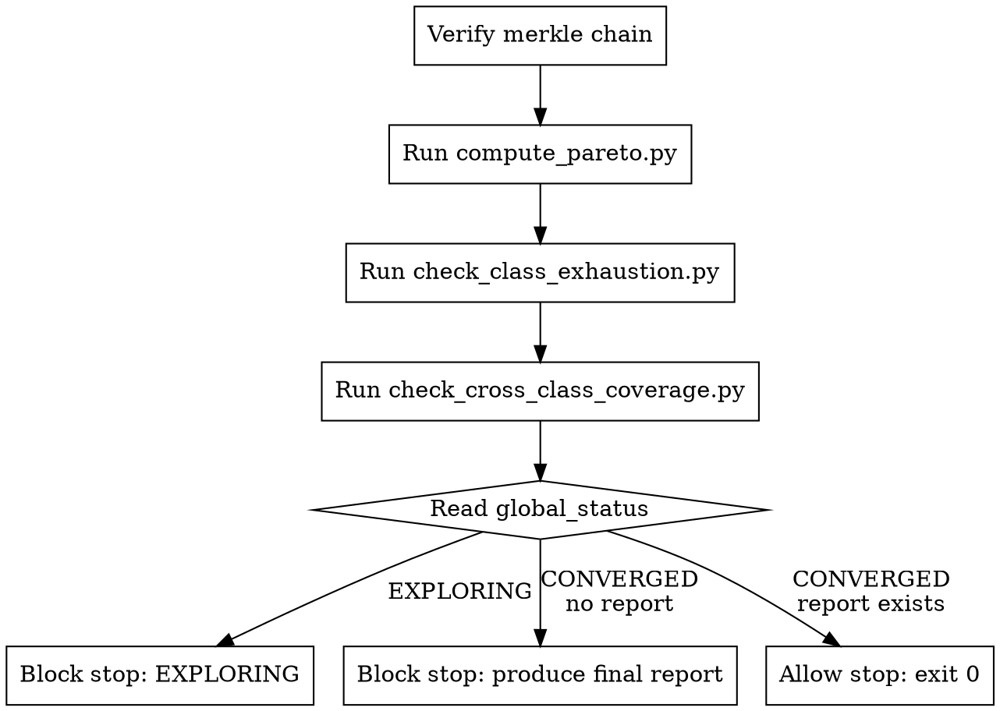

<!-- design-region-clean-of-hard-gates -->

# Converge

<HARD-GATE>
Do NOT declare CONVERGED without all three cross-class conditions passing via executed scripts. STOP and return EXPLORING.
</HARD-GATE>

<HARD-GATE>
Do NOT declare CONVERGED if any architecture class remains in EXPLORING status unless all UNTRIED classes have been attempted. NEVER override script verdicts.
</HARD-GATE>

## Anti-Pattern

**"We have a decent result, let's stop here"** -- "decent" is not a convergence signal. The scripts check three within-class conditions and three cross-class conditions. All must pass. If any fails, the system keeps exploring.

## Core Principle

Convergence is the mechanical output of executed scripts, not a judgment call.

## Process Flow



## Checklist

1. Run verify_merkle_chain.py on the experiment tree
2. Run compute_pareto.py to update the Pareto front
3. Run check_class_exhaustion.py for each architecture class
4. Run check_cross_class_coverage.py with convergence config
5. Read global_status and enforce the verdict
6. Trigger divergence enforcement if minimum class count is unmet

## Step Details

### 1. Verify Merkle Chain

Run verify_merkle_chain.py on .auto-trainer/experiment-tree.json. If the chain is tampered, return BLOCKED_TAMPER immediately.

### 2. Compute Pareto Front

Run compute_pareto.py to update the pareto_front field in the tree. Capture stdout for the report trail.

### 3. Check Within-Class Exhaustion

Run check_class_exhaustion.py to evaluate three conditions per architecture class. A class becomes EXHAUSTED when any condition fires:

- **Diminishing returns** -- less than 1% relative improvement over the last 2 rounds AND the class has reached depth >= 2
- **Depth ceiling** -- the class has been refined to depth >= 2 with no remaining untried variants at shallower depths
- **Pareto domination** -- another class strictly dominates this one on both metric and parameter count AND depth >= 1

A class that has not been tried remains UNTRIED. A class with active experiments that has not hit any exhaustion condition remains EXPLORING.

### 4. Check Cross-Class Convergence

Run check_cross_class_coverage.py to evaluate three global conditions. All must hold simultaneously:

- **Minimum class count** -- the number of explored classes (EXHAUSTED or EXPLORING) meets or exceeds architecture_classes_minimum from convergence-config.json
- **All classes settled** -- no class has status EXPLORING (every explored class is EXHAUSTED or DOMINATED)
- **Pareto stability** -- the Pareto front has been identical for pareto_stability_rounds consecutive iterations

Only when all three conditions hold does the global status become CONVERGED.

### 5. Enforce the Verdict

Read global_status from the script output:

- EXPLORING: block the stop with the list of unsatisfied conditions. Claude must continue working.
- CONVERGED and final-report.md exists: allow the stop (exit 0 with no output).
- CONVERGED and final-report.md does not exist: block with reason "CONVERGED -- produce final report and Kaggle submission."

### 6. Divergence Enforcement

If Tier 2 condition 1 fails (not enough architecture classes explored), generate variants from untried classes before convergence can occur. The explore skill reads class_status from the tree and prioritizes UNTRIED classes when the minimum has not been met.

## Gate Functions

- BEFORE assessing convergence: "Am I running .auto-trainer/scripts/check_convergence.sh or its component scripts, not computing convergence conditions inline?"
- BEFORE declaring CONVERGED: "Have all three cross-class conditions passed in the latest script run?"
- BEFORE updating class status: "Did check_class_exhaustion.py produce this status, or am I inferring it?"
- BEFORE allowing a stop: "Does final-report.md exist in .auto-trainer/?"
- BEFORE blocking a stop: "What specific conditions remain unsatisfied?"

## Rationalization Table

| You think... | Reality |
|---|---|
| The metrics look converged to me | Run the scripts and read their stdout |
| "I can check the class statuses and Pareto front directly" | Run the convergence scripts -- inline computation misses edge cases the scripts handle (Merkle verification, pareto_history appending, atomic JSON writes). |
| One more round will not help | Run check_class_exhaustion.py and let it decide |
| We have explored enough classes | Verify the count against architecture_classes_minimum |
| The Pareto front is stable | Run check_cross_class_coverage.py and read pareto_stability_rounds |

## Red Flags

- "looks converged"
- "good enough to stop"
- "diminishing returns based on the numbers I see"
- "all classes are exhausted"
- "the front has not changed"

## Key Principles

- Convergence is binary: scripts return EXPLORING or CONVERGED, nothing in between
- Within-class exhaustion requires meeting at least one of three mechanical conditions
- Cross-class convergence requires all three conditions simultaneously
- The Stop hook is the enforcement mechanism, not a suggestion
- Divergence enforcement prevents premature convergence on a single architecture family
- Merkle chain verification runs before any convergence check

## The Bottom Line

```bash
echo "VERDICT: run the convergence scripts, read their output, report what they say -- EXPLORING or CONVERGED"
```

## Status Vocabulary

- **EXPLORING** -- at least one convergence condition is unsatisfied, continue working
- **CONVERGED** -- all Tier 1 and Tier 2 conditions passed, trigger final-report
- **BLOCKED** -- cannot assess convergence (no experiment tree, no config, merkle failure)
