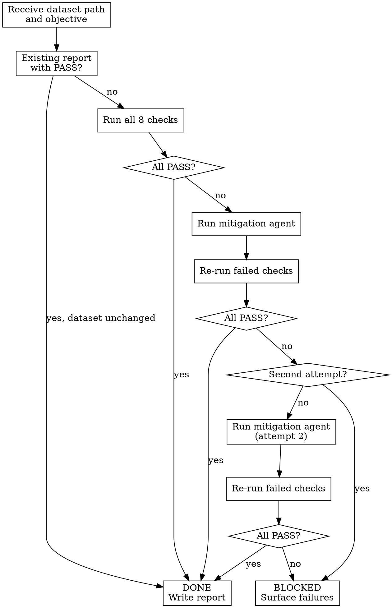

<!-- design-region-clean-of-hard-gates -->

# Data Validate

<HARD-GATE>
Do NOT proceed to baseline without a PASS verdict in `.auto-trainer/data-quality-report.json`. STOP and run all 8 checks first, reusing an existing PASS report only if the dataset path and modification time are unchanged.
</HARD-GATE>

<HARD-GATE>
Do NOT interpret metric values by reading output unless the result is written to structured JSON. NEVER eyeball check results -- all 8 checks produce their results into a structured JSON object that downstream skills read programmatically.
</HARD-GATE>

## Anti-Pattern

**"The data looks clean enough to start training"** -- there is no "clean enough." The checks run, the JSON report is produced, and the report says PASS or FAIL. Gut feelings about data quality are not evidence.

## Core Principle

Every dataset earns a PASS verdict through 8 executed checks before any model touches it.

## Process Flow



## Checklist

1. Locate the dataset and objective
2. Spawn a domain research agent to infer column semantics and domain context
3. Check for an existing valid report
4. Run Shape and Size check
5. Run Data Types check
6. Run Missing Values check
7. Run Target Variable check
8. Run Duplicates check
9. Run Distributions check
10. Run Correlations check
11. Run Outliers check
12. Evaluate check results and mitigate if needed
13. Write the final JSON report

## Step Details

### 1. Locate the dataset and objective

Read the objective file to find the dataset path and target column. Verify the file exists on disk. If the file does not exist, emit BLOCKED.

### 2. Spawn a domain research agent to infer column semantics and domain context

Spawn a research agent that reads column names, the first 5 rows of sample values, data types, and the objective. The agent:

- Infers the domain (maritime transport, real estate, medical or clinical, financial, retail, and so on)
- Writes a one-sentence semantic description for every column explaining what it represents in that domain
- Identifies known domain relationships between columns
- Flags identifiers, leakage risks, and high-value feature engineering candidates
- Searches for whether this dataset has a known original source. Playground Series competitions are generated from real datasets, so finding the original is the highest-impact technique.
- Returns a structured `domain_context` object

Pass the agent this prompt: "You are a domain expert, not a statistician. Explain what each column means in the real world, what relationships a domain expert would know, and whether there is an original source dataset."

### 3. Check for an existing valid report

Look for `.auto-trainer/data-quality-report.json`. If it exists, has `status: "PASS"`, and the dataset path and modification time match, reuse it and emit DONE. Otherwise proceed to checks.

### 4. Run Shape and Size check

Measure the number of samples and features. Compute the samples-per-feature ratio. Flag if the ratio is less than 10 -- models with fewer than 10 samples per feature are prone to overfitting and unreliable validation splits.

### 5. Run Data Types check

Record the dtype of every column. Attempt automatic type coercion where obvious (e.g., numeric strings to float). Compute the coercion-failure rate: the percentage of values that cannot be coerced to their expected type. Flag if the coercion-failure rate exceeds 5% for any column.

### 6. Run Missing Values check

Compute the missing-value percentage for every column. Apply mitigation by band:

| Missing % | Band | Mitigation |
|---|---|---|
| < 5% | Low | Simple imputation (median for numeric, mode for categorical) |
| 5% - 20% | Moderate | Advanced imputation (KNN or iterative imputer) |
| 20% - 50% | High | Add a binary missingness indicator column, then impute |
| > 50% | Critical | Drop the column entirely |

### 7. Run Target Variable check

Verify the target column exists in the dataset. Record its dtype (numeric or categorical). Compute the percentage of missing values in the target. Compute the variance (numeric) or class distribution (categorical). Flag if the target is missing, has zero variance, or has more than 20% missing values.

### 8. Run Duplicates check

Count exact duplicate rows. Compute duplicates as a percentage of total rows. Flag if duplicates exceed 1% of the dataset. Report the number of unique rows and the number of duplicates removed if mitigation is applied.

### 9. Run Distributions check

For each numeric column, compute skewness. Flag columns with absolute skewness greater than 2. Identify zero-variance columns (standard deviation of 0). Identify near-constant columns where fewer than 1% of values are unique. Flag all three categories.

### 10. Run Correlations check

Compute the pairwise Pearson correlation matrix for numeric columns. Flag pairs with |r| > 0.95 as redundant. Check for target leakage: any feature with |r| > 0.95 to the target variable that was not expected (not in any known-safe list). Compute Variance Inflation Factor (VIF) for all numeric features and flag any with VIF > 10.

### 11. Run Outliers check

Compute the Median Absolute Deviation (MAD) modified Z-score for each numeric column. Flag rows where more than 5% of numeric columns have |modified Z-score| > 3.5. Report the total number of flagged rows and their percentage of the dataset.

### 12. Evaluate check results and mitigate if needed

If all 8 checks pass, proceed to writing the report. If any checks fail, run the autonomous mitigation agent. Mitigation gets at most 2 attempts. After each mitigation round, re-run only the failed checks. If checks still fail after 2 rounds, emit BLOCKED and surface the specific failing checks.

### 13. Write the final JSON report

Write all results to `.auto-trainer/data-quality-report.json`:

```json
{
  "status": "PASS",
  "dataset_path": "data/train.csv",
  "timestamp": "2026-06-10T14:30:00Z",
  "mitigation_rounds": 1,
  "domain_context": {
    "inferred_domain": "maritime passenger transport",
    "column_semantics": {"Cabin": "Room assignment: deck/number/side", "Name": "Full name with title indicating social class"},
    "known_relationships": ["Cabin deck correlates with ticket class"],
    "external_data_candidates": [],
    "leakage_risks": []
  },
  "checks": {
    "shape_and_size": {
      "passed": true,
      "samples": 1460,
      "features": 80,
      "samples_per_feature": 18.25
    },
    "data_types": {
      "passed": true,
      "columns_checked": 80,
      "coercion_failures": {},
      "max_coercion_failure_rate": 0.0
    },
    "missing_values": {
      "passed": true,
      "columns_with_missing": 19,
      "mitigations_applied": {
        "LotFrontage": {"band": "moderate", "method": "knn_imputer"},
        "Alley": {"band": "critical", "method": "dropped"},
        "MasVnrType": {"band": "low", "method": "mode_imputer"}
      }
    },
    "target_variable": {
      "passed": true,
      "name": "SalePrice",
      "dtype": "float64",
      "missing_pct": 0.0,
      "variance": 6318981503.31
    },
    "duplicates": {
      "passed": true,
      "duplicate_rows": 0,
      "duplicate_pct": 0.0
    },
    "distributions": {
      "passed": true,
      "high_skew_columns": ["LotArea", "GrLivArea"],
      "zero_variance_columns": [],
      "near_constant_columns": ["Street", "Utilities"]
    },
    "correlations": {
      "passed": true,
      "redundant_pairs": [["GarageArea", "GarageCars"]],
      "leakage_suspects": [],
      "high_vif_columns": []
    },
    "outliers": {
      "passed": true,
      "flagged_rows": 12,
      "flagged_pct": 0.82
    }
  }
}
```

## Gate Functions

- BEFORE running any check: "Does the dataset file exist on disk at the specified path?"
- BEFORE running statistical checks: "Did the domain research agent return a domain_context with column_semantics for every column?"
- BEFORE applying mitigation: "Which specific checks failed and what is the mitigation band for each?"
- BEFORE writing the final report: "Have all 8 checks been executed and their results captured in structured JSON?"
- BEFORE emitting DONE: "Does the report JSON have status PASS and valid entries for all 8 checks?"
- BEFORE re-running checks after mitigation: "Was the mitigation applied to the correct columns with the correct method?"

## Rationalization Table

| You think... | Reality |
|---|---|
| "A few missing values won't matter" | Run the missing-values check and let the band thresholds decide the mitigation strategy |
| "I checked the data manually" | Run all 8 checks programmatically and write results to JSON |
| "Outliers are just noise" | Run the MAD modified Z-score check and flag rows exceeding the threshold |
| "The types look correct" | Run coercion on every column and measure the failure rate |
| "Column names are self-explanatory" | Dispatch the domain research agent -- column names hide semantic meaning that statistical checks cannot discover. |

## Red Flags

- "I can skip validation because the data came from a trusted source"
- "Only a few columns have issues"
- "The data looks fine from the first few rows"
- "Missing values are under control"
- "I already checked this dataset before"
- "I already know what these columns mean"

## Key Principles

- All 8 checks are non-negotiable and run in order
- Every numerical result goes into structured JSON, never into prose
- Mitigation runs autonomously first, escalating to the human only after 2 failed attempts
- Mitigation gets at most 2 attempts before emitting BLOCKED
- A reused report is valid only if the dataset path and modification time match

## The Bottom Line

```bash
STATUS=$(python3 -c "
import json, sys
with open('.auto-trainer/data-quality-report.json') as f:
    report = json.load(f)
all_passed = all(c['passed'] for c in report['checks'].values())
print('PASS' if report['status'] == 'PASS' and all_passed else 'FAIL')
")
echo "VERDICT: $STATUS"
```

## Status Vocabulary

- **DONE** -- all 8 checks passed (with or without mitigation), report written
- **DONE_WITH_CONCERNS** -- all checks passed but mitigations were applied that downstream skills must be aware of (e.g., columns dropped, heavy imputation)
- **BLOCKED** -- one or more checks still failing after 2 mitigation rounds, human intervention required
