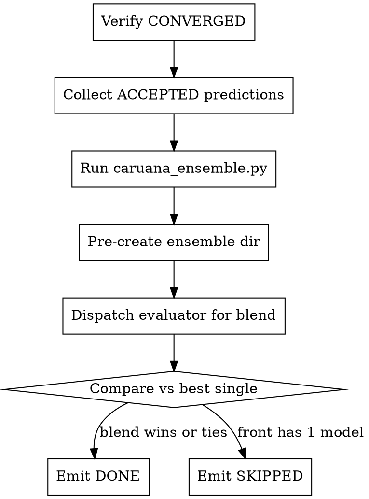

<!-- design-region-clean-of-hard-gates -->

# Ensemble

<HARD-GATE>
Do NOT invoke this as a standalone skill or dispatch it as a subagent, unless reading it as reference. STOP -- the auto-train orchestrator runs caruana_ensemble.py directly.
</HARD-GATE>

<HARD-GATE>
Do NOT write a custom ensemble script outside of caruana_ensemble.py. NEVER replace the provided script.
</HARD-GATE>

## Anti-Pattern

**"Let me dispatch an ensemble subagent"** -- the orchestrator runs the provided script directly. No subagent is dispatched for this step.

## Core Principle

The orchestrator executes the provided Caruana selection script directly, eliminating the dispatch boundary where drift occurred.

## Process Flow



## Checklist

1. Verify global_status is CONVERGED in the experiment tree
2. Collect val_predictions.npy and val_labels.npy from ALL variants with evaluate verdict ACCEPT
3. Execute caruana_ensemble.py to produce the weighted blend config
4. Pre-create the ensemble directory chained to the best single model
5. Dispatch the evaluator on the blend
6. Compare the blend metric against the best single model and emit the verdict

## Step Details

The following documents what the auto-train orchestrator performs for reference. It runs these steps directly and does not dispatch a subagent.

### 1. Verify Convergence

The orchestrator reads global_status from .auto-trainer/experiment-tree.json. If the value is CONVERGED, it proceeds. If the Pareto front contains exactly 1 model, it emits SKIPPED -- a single member has no blend to construct.

### 2. Collect Predictions

The orchestrator collects val_predictions.npy and val_labels.npy from ALL variants with evaluate verdict ACCEPT, not only Pareto-front members. It passes all ACCEPTED model worktree paths to caruana_ensemble.py and does NOT filter to the Pareto front, since the greedy selection performs its own filtering internally. For each node where verdict is ACCEPT or KEEP, it adds that worktree path to the candidate list. Each eval.py variant saves these two arrays during its evaluation run; a candidate missing either array blocks the blend until that candidate re-runs eval.py.

### 3. Run Caruana Selection

Before selection, the orchestrator assesses candidate diversity across the ACCEPTED models by counting distinct architecture_class values:

- All same class (for example, all tree_based): low diversity. The orchestrator logs a warning and notes in the final report that exploration did not produce sufficient architectural diversity.
- 2+ distinct classes: the orchestrator proceeds. Diversity is the source of ensemble gain.

A blend of two gradient boosters produces less diversity than a blend spanning trees, linear, and neural classes. Ensembles gain from disagreement between models that make different errors.

The orchestrator executes the greedy selection script directly:

```bash
python3 .auto-trainer/scripts/caruana_ensemble.py .auto-trainer/experiment-tree.json <metric_key> <metric_direction> .auto-trainer/worktrees/exp_ensemble/ensemble_config.json
```

It reads metric_key and metric_direction from the experiment tree. The script reads each candidate's saved predictions, runs greedy forward selection against the held-out labels, and writes the weighted member list to ensemble_config.json. The orchestrator captures stdout for the report trail.

### 4. Pre-create the Ensemble Directory

The orchestrator pre-creates the exp_ensemble directory before execution and sets its parent hash to the best single model, so the Merkle chain records the blend as a child of the strongest member. The ensemble node carries ensemble_config.json plus an eval.py that loads each member's predictions and applies the weights.

### 5. Evaluate the Blend

The orchestrator dispatches the evaluator on exp_ensemble through the 4-layer evaluate pipeline. The blend earns a metric only when all four layers pass; a layer rejection blocks the ensemble from claiming a result.

### 6. Compare and Emit

The orchestrator compares the blend's evaluated metric against the best single model via the executed comparison, as a single pass with no iteration:

- Blend strictly beats the best single model: emit DONE with the blend as the recommended solution.
- Blend ties the best single model: emit DONE_WITH_CONCERNS and record the tie for the final report.
- Pareto front held 1 model at step 1: emit SKIPPED.

## Gate Functions

- BEFORE this step: "Is global_status in the experiment tree CONVERGED?"
- BEFORE selection: "Does every ACCEPTED candidate carry val_predictions.npy and val_labels.npy?"
- BEFORE selection: "Do the ACCEPTED models span at least 2 distinct architecture_class values?"
- BEFORE blending: "Is the orchestrator executing .auto-trainer/scripts/caruana_ensemble.py, not a custom script?"
- BEFORE declaring a winner: "Did the blend pass all four evaluate layers?"
- BEFORE emitting DONE: "Did the executed comparison show the blend beating the best single model?"

## Rationalization Table

| You think... | Reality |
|---|---|
| The best single model already won | Run caruana_ensemble.py and let the blend metric decide |
| The front is small, a blend cannot help | Run selection across every ACCEPTED member first |
| I can read the weights and call it | Pass the blend through all four evaluate layers |
| The blend obviously beats the single | Run the executed comparison and read its output |
| One member lacks predictions, skip it | Rerun that member's eval.py to save val_predictions.npy |
| Averaging two good models is enough | Check architecture_class diversity, since correlated models add noise, not signal |
| Both candidates are gradient boosters, they complement each other | Read the architecture_class field, since same-class models produce correlated errors and minimal blend gain |

## Red Flags

- "let me dispatch an ensemble subagent"
- "I can write a faster blending script for this case"
- "the single model is fine"
- "blending never helps here"
- "the weights look right"
- "close enough to the best single"
- "both models are gradient boosters so they complement each other"

## Key Principles

- This step fires only after the exploration loop reaches CONVERGED
- The orchestrator runs caruana_ensemble.py directly, with no subagent dispatch
- Greedy selection runs as an executed script, never by hand-tuned weights
- The blend earns a result only by passing all four evaluate layers
- The ensemble node chains to the best single model in the Merkle lineage
- Selection is a single pass with no iteration loop
- A Pareto front of one member yields SKIPPED

## The Bottom Line

```bash
echo "VERDICT: the orchestrator blends the Pareto front via caruana_ensemble.py, evaluates through 4 layers, emits DONE only when the executed comparison shows the blend wins"
```

## Status Vocabulary

- **DONE** -- the blend evaluated cleanly and beat the best single model
- **SKIPPED** -- the Pareto front held a single member, no blend to construct
- **DONE_WITH_CONCERNS** -- the blend evaluated but tied the best single model
