<!-- design-region-clean-of-hard-gates -->

# Evaluate

<HARD-GATE>
STOP and use the manifest contents from the dispatch prompt. Do NOT search for metrics_manifest.json on disk if the dispatch prompt already carries it.
</HARD-GATE>

<HARD-GATE>
STOP and execute the extraction command declared in the inline manifest. Do NOT write custom metric extraction code unless the inline manifest declares none.
</HARD-GATE>

<HARD-GATE>
Do NOT assess convergence without executing a slope computation script. NEVER judge from visual inspection of loss curves.
</HARD-GATE>

## Anti-Pattern

"Let me find the metrics manifest in the worktree" -- the manifest contents are in the dispatch prompt. Execute the extraction command from the inline manifest, not a custom script.

## Core Principle

Execute run.sh in the provided worktree, extract metrics using the inline manifest command, run the 4 layers, and write EVALUATION.json.

## Inline Context

Evaluate runs as a Task subagent dispatched by auto-train. The dispatch prompt carries everything inline:

- The worktree path to run.
- The metrics manifest CONTENTS, including the extraction command for each declared metric.
- The baseline metrics for significance and overfitting comparison.
- The significance threshold.
- The domain context, including inferred_domain for threshold calibration.

The baseline metrics, significance threshold, and domain context (inferred_domain for threshold calibration) are in your dispatch prompt. Do not read from experiment-tree.json or data-quality-report.json.

## Process Flow

```dot
digraph evaluate {
  rankdir=LR;
  node [shape=box];
  run_variant [label="Run Variant"];
  extract_metrics [label="Extract Metrics"];
  layer1 [label="Layer 1: Data Validation"];
  layer2 [label="Layer 2: Overfitting"];
  layer3 [label="Layer 3: Significance"];
  layer4 [label="Layer 4: Forensics"];
  emit_verdict [label="Emit Verdict"];
  run_variant -> extract_metrics -> layer1 -> layer2 -> layer3 -> layer4 -> emit_verdict;
}
```



## Checklist

1. Execute run.sh at the worktree path from dispatch and capture all output.
2. Extract every metric by executing the command from the inline manifest.
3. Run Layer 1: Data Validation checks.
4. Run Layer 2: Overfitting Detection via executed script.
5. Run Layer 3: Statistical Significance via executed script.
6. Run Layer 4: Training Forensics via executed script.
7. Write the structured EVALUATION.json with verdict.

## Step Details

### 1. Run the Variant

Execute `run.sh` at the worktree path from dispatch. Capture stdout, stderr, and exit code. If the exit code is non-zero, emit CRASHED with the error output.

### 2. Extract Metrics

For each metric declared in the inline manifest, execute the extraction command specified in that manifest. Collect all metric values into a structured dict. The manifest contents arrive in the dispatch prompt, so there is no file to open.

### 3. Layer 1: Data Validation

Check the raw metric output for integrity:

- Every metric name declared in the inline manifest has a corresponding value in the extracted results.
- No metric value is NaN or Inf.
- Epoch count in training logs matches the configured epoch count in constraints.lock (tolerance: +/- 1).

Verdict if any check fails: REJECT. Reason: data validation failure. List every failing check.

### 4. Layer 2: Overfitting Detection

Compare training metrics against validation metrics by executing a script that:

- Computes the gap ratio: `(train_metric - val_metric) / train_metric` for each metric.
- Compares gap ratio against the baseline gap ratio from the dispatch prompt.
- Flags if gap ratio exceeds 2x the baseline gap ratio.
- Flags if validation loss is monotonically increasing over the last 25% of epochs.

Use the inferred_domain from the dispatch prompt to adjust the gap_ratio threshold:

- Medical/clinical data: stricter threshold (0.05)
- Financial data: stricter threshold (0.05)
- Playground/synthetic data: standard threshold (0.10)
- Generic tabular: standard threshold (0.10)

If inferred_domain is absent from the dispatch prompt, use the standard threshold.

Verdict if any flag triggers: REJECT. Reason: overfitting detected. Report the gap ratios and which flags triggered.

### 5. Layer 3: Statistical Significance

Determine whether the improvement over baseline is meaningful by executing a script that:

- Computes relative change: `(variant_metric - baseline_metric) / baseline_metric` for the primary metric, using the baseline metrics from the dispatch prompt.
- Compares against the significance threshold from the dispatch prompt (default: 1% relative improvement for the primary metric).
- For secondary metrics, threshold is 0.5% relative improvement.

Calibrate practical significance against the inferred_domain from the dispatch prompt. A 0.5% accuracy improvement on medical diagnosis is clinically meaningful. The same 0.5% on a Playground Series dataset is noise. Medical/financial domains: lower threshold to 0.5%. Synthetic/playground: raise to 2%.

Verdict if below threshold: INCONCLUSIVE. Reason: improvement not statistically significant. Report the relative changes.

### 6. Layer 4: Training Forensics

Inspect the training trajectory for instability by executing a script that:

- Checks for NaN in any epoch's metrics (not just the final epoch).
- Checks for spikes: any epoch-to-epoch metric change exceeding 3x the median epoch-to-epoch change.
- Checks for mode collapse: standard deviation of metric values over last 25% of epochs below 1e-6.

Domain-specific anomaly patterns, keyed on the inferred_domain from the dispatch prompt:

- Financial data: flag sudden distribution shifts between early and late epochs
- Medical data: flag if the model predicts majority class for > 90% of validation samples
- Large datasets (> 100K rows): flag if training completes in < 5 seconds

Verdict if any check fails: REJECT. Reason: training instability. Report which forensic checks failed and at which epochs.

### 7. Emit Verdict

Apply the decision logic and write the evaluation result to `<worktree-path>/EVALUATION.json`:

| Layer 1 | Layer 2 | Layer 3 | Layer 4 | Verdict |
|---|---|---|---|---|
| PASS | PASS | Significant | PASS | ACCEPT |
| FAIL | -- | -- | -- | REJECT |
| PASS | FAIL | -- | -- | REJECT |
| PASS | PASS | Not significant | PASS | INCONCLUSIVE |
| PASS | PASS | -- | FAIL | REJECT |

Structured output format:

```json
{
  "node_sha": "abc123...",
  "verdict": "ACCEPT",
  "primary_metric": {
    "name": "rmse",
    "value": 0.142,
    "baseline_value": 0.158,
    "relative_change": -0.101
  },
  "secondary_metrics": [
    {
      "name": "mae",
      "value": 0.098,
      "baseline_value": 0.112,
      "relative_change": -0.125
    }
  ],
  "layers": {
    "data_validation": {"passed": true, "details": {}},
    "overfitting": {"passed": true, "gap_ratio": 0.03, "baseline_gap_ratio": 0.02},
    "statistical_significance": {"passed": true, "relative_change": -0.101, "threshold": 0.01},
    "forensics": {"passed": true, "nan_epochs": [], "spikes": [], "mode_collapse": false}
  }
}
```

## Gate Functions

- BEFORE extracting metrics: "Am I executing the command from the inline manifest, not writing a custom extraction script?"
- BEFORE computing significance: "Am I using the baseline metrics from my dispatch prompt, not reading from the experiment tree?"
- BEFORE comparing train vs validation metrics: "Is a script computing the gap ratios, not mental arithmetic?"
- BEFORE declaring significance: "Is the relative change computed by an executed script against the threshold from dispatch?"
- BEFORE emitting ACCEPT: "Did all four layers pass via executed scripts with no manual overrides?"

## Rationalization Table

| You think... | Reality |
|---|---|
| "Let me find the metrics manifest in the worktree" | Use the manifest contents from the dispatch prompt because the orchestrator already passed them inline. |
| "Let me read the data quality report for domain context" | Use the inferred_domain from the dispatch prompt because the orchestrator already extracted it. |
| "The numbers are right there in the log, I can just read them" | Run the extraction command because manual reading introduces transcription errors. |
| "I can read the metrics directly from the training output" | Run the extraction command from the inline manifest because direct reading bypasses the validation the manifest command encodes. |
| "This is clearly overfitting from the gap" | Run the overfitting detection script because visual gap assessment is unreliable. |
| "The improvement is obviously significant" | Run the relative change script against the threshold because intuition miscalibrates on small differences. |
| "Training looks stable enough" | Run forensics checks because spikes and mode collapse hide in aggregate metrics. |
| "The same thresholds work for every dataset" | Use the inferred_domain from dispatch to calibrate because medical and financial data need stricter overfitting gates than synthetic competitions. |

## Red Flags

- "I can see the metric value is..."
- "The loss clearly converged"
- "This improvement is obviously significant"
- "Training looks stable"

## Key Principles

- Every metric value originates from the inline manifest extraction command, never from log reading.
- The 4-layer defense runs in strict order; failure at any layer short-circuits remaining layers.
- Convergence assessment belongs to the converge skill, not to evaluate.
- Structured JSON output enables downstream automation without parsing prose.
- Baseline comparison from the dispatch prompt anchors all significance and overfitting checks.

## The Bottom Line

```bash
echo "VERDICT: execute every comparison as a script, trust script output over visual inspection"
```

## Status Vocabulary

- **ACCEPT** -- variant passed all 4 layers and improvement is significant
- **REJECT** -- variant failed one or more layers
- **INCONCLUSIVE** -- variant passed validation, overfitting, and forensics checks but improvement is not significant
- **CRASHED** -- run.sh exited non-zero, runtime failure (OOM, NaN, timeout)
</content>
</invoke>
