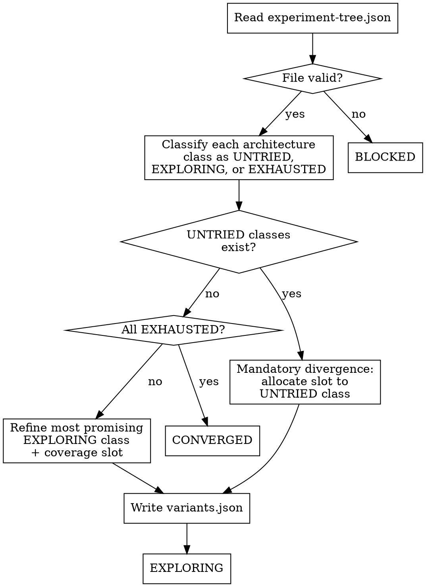

<!-- design-region-clean-of-hard-gates -->

# Explore

<HARD-GATE>
Do NOT propose any variant without reading `.auto-trainer/experiment-tree.json` first. STOP and load the full experiment tree or emit BLOCKED.
</HARD-GATE>

<HARD-GATE>
Do NOT propose a hyperparameter-only variant for an EXHAUSTED class if any UNTRIED class exists. NEVER tune hyperparameters when unexplored architecture classes remain.
</HARD-GATE>

## Anti-Pattern

**"The last variant improved, let me just tune its learning rate"** -- hyperparameter tuning accounts for a small fraction of variance. Architecture choice dominates. Refine only when architecture options are exhausted or the Pareto front shows diminishing returns on new architectures.

## Core Principle

Explore architectural directions before tuning hyperparameters, with mandatory divergence toward untried classes in every batch.

## Process Flow



## Checklist

1. Read and validate the experiment tree
2. Classify architecture classes
3. Apply scenario-based decision logic
4. Incorporate data quality biases
5. Generate variant specs
6. Write variants.json

## Step Details

### 1. Read and validate the experiment tree

Read `.auto-trainer/experiment-tree.json` in full. Verify the file parses as valid JSON with a `nodes` object and `pareto_front` array. If the file does not exist or is malformed, emit BLOCKED.

### 2. Classify architecture classes

For each of the six architecture classes (linear, tree_based, neural_net, ensemble, svm, knn), determine the status:

| Class | Tag | Examples |
|---|---|---|
| Linear models | `linear` | LogisticRegression, Ridge, Lasso, ElasticNet, SGDClassifier |
| Tree-based models | `tree_based` | DecisionTree, RandomForest, GradientBoosting |
| Neural networks | `neural_net` | MLP, TabNet, wide-and-deep, residual MLP |
| Ensembles | `ensemble` | VotingClassifier, StackingRegressor, Blending |
| Support vector machines | `svm` | SVC, SVR, LinearSVC, NuSVR |
| Nearest neighbors | `knn` | KNeighborsClassifier, KNeighborsRegressor, RadiusNeighbors |
| catboost | CatBoostClassifier, CatBoostRegressor -- handles categorical features natively without one-hot encoding, strongest on datasets with many categoricals |

Classify each as UNTRIED (never attempted), EXPLORING (at least one variant running or accepted), or EXHAUSTED (all variants rejected or showing diminishing returns).

### 3. Apply scenario-based decision logic

**Scenario 1: UNTRIED classes exist alongside EXHAUSTED classes.** Mandatory divergence. At least one variant must come from an UNTRIED class. Remaining slots refine EXPLORING classes. Do not propose HP-only changes for EXHAUSTED classes.

**Scenario 2: All classes are EXPLORING (none UNTRIED, none EXHAUSTED).** Refine the most promising EXPLORING class (highest metric on the Pareto front). Allocate one slot to the least-explored EXPLORING class to maintain coverage. HP tuning is now permitted.

**Scenario 3: All classes are EXHAUSTED.** No promising unexplored directions remain. Emit CONVERGED.

When proposing first-round variants for UNTRIED classes, read `domain_context.column_semantics` from `data-quality-report.json`:

- Many categorical columns (> 4) with moderate cardinality (5-50 unique): prioritize catboost.
- Large dataset (> 50K rows), predominantly numeric columns: prioritize tree_based with a gradient-boosting model.
- Small dataset (< 2K rows), many features (> 30): prioritize linear with regularization.
- `domain_context.known_relationships` mentions non-linear interactions: include neural_net.

#### Depth Refinement Diagnosis

When proposing depth refinements for an EXPLORING class at depth >= 2, spawn a diagnosis agent that reads the best variant's evaluation result and training history, then returns a structured diagnosis:

| Symptom | Diagnosis | Proposed HP Direction |
|---|---|---|
| Train loss still decreasing, val loss flat | Underfitting on val features | Increase capacity: more estimators, deeper trees, wider layers |
| Train loss low, val loss diverging | Overfitting | Increase regularization: higher alpha/C, add dropout, fewer estimators |
| Both losses flat early | Capacity ceiling hit | Signal explore to try a different class instead |
| Loss spiky / unstable | Learning rate too high | Reduce learning rate, increase batch size |
| Train and val both good but not improving | Diminishing returns | Mark class EXHAUSTED |

The diagnosis agent returns `{symptom, diagnosis, proposed_direction, specific_hp_key, specific_hp_value}`. Use the `specific_hp_key` and `specific_hp_value` as the single-key config_delta. The `hypothesis` field carries the diagnosis.

The diagnosis agent reads `domain_context` alongside the training trajectory. When `known_relationships` describes non-linear interactions and the model is linear, recommend trying a tree-based or neural architecture instead of tuning hyperparameters within the linear class.

### 4. Incorporate data quality biases

If `.auto-trainer/data-quality-report.json` exists, use it to bias class selection:

- **High missing-value ratio (>20%):** Favor `tree_based` (native missing-value handling).
- **High cardinality categoricals (>100 unique):** Favor `neural_net` (learned embeddings).
- **Strong linear correlations (top feature r > 0.7):** Favor `linear` with regularization.
- **Small dataset (<1000 rows):** Avoid `neural_net`. Favor `linear`, `svm`, `knn`.
- **Large dataset (>100k rows):** `neural_net` viable. Avoid `knn` (inference cost). `tree_based` strong default.

These are biases, not mandates. Mandatory divergence still applies.

### 5. Generate variant specs

Build a JSON array of variant specs. Each element:

```json
{
  "parent_id": "sha-of-parent-node-or-baseline",
  "architecture_class": "tree_based",
  "config_delta": {
    "model_type": "xgboost"
  },
  "hypothesis": "XGBoost handles the high missing-value ratio without imputation overhead"
}
```

Rules:
- `parent_id` references an existing node SHA in the experiment tree, or `"baseline"`.
- `architecture_class` must be one of the six tags.
- `config_delta` contains exactly one key representing the single change from parent. Compound changes split into separate variants.
- `hypothesis` states what improvement is expected and why.

Write domain-grounded hypotheses. Instead of "this model improves the score", write "catboost proposed because `domain_context` shows 6 categorical columns with moderate cardinality, so native handling avoids the information loss from encoding".

### 6. Write variants.json

Write the variant array to `.auto-trainer/variants.json`. Overwrite any previous contents.

## Gate Functions

- BEFORE proposing first-round variants: "If the dataset has 4+ categorical columns with 5-50 unique values, is catboost included in the proposed batch?"
- BEFORE classifying architecture classes: "Has experiment-tree.json been read and validated as parseable JSON?"
- BEFORE proposing an HP-only variant: "Are all UNTRIED classes accounted for with at least one slot in the batch?"
- BEFORE proposing depth-2+ HP changes: "Did a diagnosis agent analyze the training trajectory and return a structured diagnosis?"
- BEFORE writing variants.json: "Does every variant spec have a valid parent_id, architecture_class tag, single-key config_delta, and hypothesis?"
- BEFORE emitting CONVERGED: "Are all six architecture classes confirmed EXHAUSTED with no remaining promising directions?"

## Rationalization Table

| You think... | Reality |
|---|---|
| "Tuning the learning rate will close the gap" | Check untried architecture classes and exhaust them before tuning hyperparameters. |
| "This class has no chance on this data" | Run at least one variant and let executed metrics decide. |
| "I already know tree models will win" | Run all mandatory divergence slots and compare on the Pareto front. |
| "I know what HP to try from the model type" | Dispatch the diagnosis agent — training trajectory analysis reveals the actual bottleneck, not model-type heuristics. |

## Red Flags

- "I can skip the untried classes"
- "One more tuning round will be enough"
- "The tree is already converged"
- "This architecture class is not worth trying"
- "I can guess the right hyperparameter adjustment"
- "Tree-based models already handle categoricals well enough"

## Key Principles

- Breadth first, depth second -- explore architecture classes before hyperparameter tuning
- Mandatory divergence: at least one UNTRIED class per batch when any remain
- The Pareto front guides pruning of explored paths, not selection of new ones
- Each variant carries exactly one change from its parent (single-key config_delta)
- Data quality biases guide class selection but do not override mandatory divergence

## The Bottom Line

```bash
STATUS=$(python3 -c "
import json, sys
with open('.auto-trainer/variants.json') as f:
    variants = json.load(f)
has_variants = len(variants) > 0
all_valid = all(
    v.get('parent_id') and v.get('architecture_class') and v.get('config_delta') and v.get('hypothesis')
    for v in variants
)
print('PASS' if has_variants and all_valid else 'FAIL')
")
echo "VERDICT: $STATUS"
```

## Status Vocabulary

- **EXPLORING** -- new variants proposed, variants.json written
- **CONVERGED** -- all architecture classes exhausted, no promising directions remain
- **BLOCKED** -- experiment-tree.json missing, malformed, or unrecoverable error
