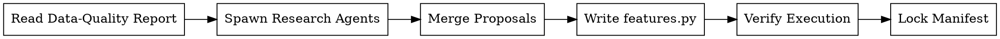

<!-- design-region-clean-of-hard-gates -->

# Feature Engineer

<HARD-GATE>
Do NOT generate features without a PASS data-quality report on disk. STOP and invoke data-validate first.
</HARD-GATE>

<HARD-GATE>
Do NOT lock features.py without verifying execution on the training data. STOP and run the verification step.
</HARD-GATE>

## Anti-Pattern

**"Raw columns are enough to start training"** -- raw columns encode the data as it was collected, not as the signal lives in it. A timestamp column holds day-of-week, month, and holiday signal that no model extracts from a raw epoch integer, and skipping that transformation throws away recoverable predictive power.

## Core Principle

Research the domain before engineering features -- spawned agents discover what the data represents and which transformations unlock signal.

## Process Flow



## Checklist

1. Read the PASS data-quality report and extract the column inventory.
2. Spawn parallel research agents over distinct column groups.
3. Merge agent proposals and resolve collisions.
4. Write features.py from the merged proposal set.
5. Verify features.py executes against the training data.
6. Lock the feature manifest with input and output hashes.

## Step Details

### 1. Read Data-Quality Report

Read `.auto-trainer/data-quality-report.json`. Confirm `status` is `PASS`. Extract the column inventory: each column's name, inferred type, cardinality, and missing-value rate. If the report is absent or its status is not `PASS`, emit BLOCKED and name the missing precondition.

### 2. Spawn Research Agents

Spawn three research agents in parallel. Each agent receives the column inventory, the target column, and the competition metric, then returns a list of proposals in this format:

**Agent 1 (Domain Features):** Reads `column_semantics` and `known_relationships` from `domain_context` in the data-quality report. Proposes features grounded in domain meaning. Housing data yields TotalSF, HouseAge, RemodAge, and QualityScore. Medical data yields lab ratios, BMI, and age-adjusted thresholds. Transport data yields group size parsed from an ID, cabin deck, and title extracted from names. Financial data yields transaction velocity and balance-to-income ratio. Prompt: "Read domain_context. For each known_relationship, propose a feature capturing it. For each column_semantic, propose transformations extracting the described meaning."

**Agent 2 (Structural Features):** Reads `distributions` and `correlations` from the report. Proposes log1p for columns with skewness above 2, interaction terms for column pairs with absolute correlation above 0.5, frequency encoding for categoricals with more than 20 unique values, and target encoding with K-fold regularization for categoricals with 5 to 20 unique values.

**Agent 3 (External Data Discovery):** Reads `external_data_candidates` from `domain_context`. When the dataset matches a synthetic Playground Series pattern, searches for the original source on Kaggle or UCI. Proposes appending the original source with a source indicator column.

```json
{
  "name": "purchase_dow",
  "source_columns": ["purchase_timestamp"],
  "transformation": "extract ISO day-of-week as integer 0-6",
  "rationale": "weekly seasonality correlates with the target in retail demand",
  "expected_impact": "medium"
}
```

Each agent grounds every `rationale` in the data the column represents, not in generic feature-engineering folklore.

### 3. Merge Proposals

Collect every agent's proposal list into one set. Detect collisions where two proposals share an identical `name` or produce a derived column from the same `source_columns` with the same `transformation`. Keep one proposal per collision, retaining the entry with the stronger `expected_impact`. Drop any proposal whose `source_columns` reference a column absent from the inventory. Rank domain-grounded features from Agent 1 above structural features from Agent 2; domain features capture causal relationships while structural features capture correlations.

### 4. Write features.py

Write `.auto-trainer/features.py` exposing a single `engineer_features(df)` function that applies every merged proposal in order and returns the augmented dataframe. Each transformation block carries the proposal `name` as its produced column. The function reads only columns present in the inventory and raises on any missing source column.

### 5. Verify Execution

Run `features.py` against the training data referenced in the data-quality report. Capture the output column set and row count. Confirm the row count is unchanged from input, confirm every proposed feature column is present in the output, and confirm zero unhandled exceptions. If execution fails, emit BLOCKED and surface the failing transformation. If execution succeeds but a subset of proposed columns is absent from the output, emit DONE_WITH_CONCERNS and list the dropped features.

### 6. Lock Manifest

Write `.auto-trainer/feature-manifest.json` recording the input data hash, the `features.py` content hash, the verified output column list, and each proposal's full record:

```json
{
  "input_data_hash": "sha256:abc123...",
  "features_py_hash": "sha256:def456...",
  "output_columns": ["purchase_dow", "amount_log", "category_freq"],
  "proposals": [
    {
      "name": "purchase_dow",
      "source_columns": ["purchase_timestamp"],
      "transformation": "extract ISO day-of-week as integer 0-6",
      "rationale": "weekly seasonality correlates with the target in retail demand",
      "expected_impact": "medium"
    }
  ]
}
```

Emit DONE once the manifest is written.

## Gate Functions

- BEFORE proposing features: "Did Agent 1 read domain_context.column_semantics and propose at least one feature per known_relationship?"
- BEFORE spawning research agents: "Does the data-quality report on disk carry status PASS?"
- BEFORE merging proposals: "Did every research agent return proposals in the required five-field format?"
- BEFORE writing features.py: "Does every retained proposal reference only columns in the inventory?"
- BEFORE locking the manifest: "Did features.py execute on the training data with the row count preserved?"

## Rationalization Table

| You think... | Reality |
|---|---|
| "Raw columns are enough to start training" | Run research agents because raw columns hide signal that transformations expose. |
| "I can write the transformations from intuition" | Dispatch parallel agents because domain research grounds each transformation in what the data represents. |
| "The features.py logic is obviously correct" | Verify execution on the training data because untested transformations crash on real column types. |
| "These two proposals are basically the same" | Check name and source-column collisions because silent duplicates inflate the feature set. |
| "I can lock the manifest after writing the file" | Verify execution first because a manifest over unverified code records a broken state. |
| "Statistical patterns are enough for feature engineering" | Read the domain_context first; domain knowledge captures causal relationships that correlation analysis misses. |

## Red Flags

- "Raw columns are enough"
- "I know which features matter without research"
- "The transformation code looks fine"
- "Skip the execution check to save time"
- "These proposals are close enough to merge blindly"
- "The data quality report already covered feature opportunities"

## Key Principles

- Domain research precedes every transformation; agents discover signal that intuition misses.
- Parallel agents partition the column inventory so each group earns focused analysis.
- Every proposal carries source columns, transformation, rationale, and expected impact.
- Execution against the training data is the gate before the manifest locks.
- The manifest chains the input data hash to the features.py hash for reproducible lineage.

## The Bottom Line

```bash
echo "VERDICT: research the domain, merge agent proposals, verify execution, then lock the manifest"
```

## Status Vocabulary

- **DONE** -- features.py verified on the training data and the manifest is locked with full lineage
- **DONE_WITH_CONCERNS** -- features.py executes but a subset of proposed features was dropped from the output
- **BLOCKED** -- no PASS data-quality report on disk or features.py fails execution
