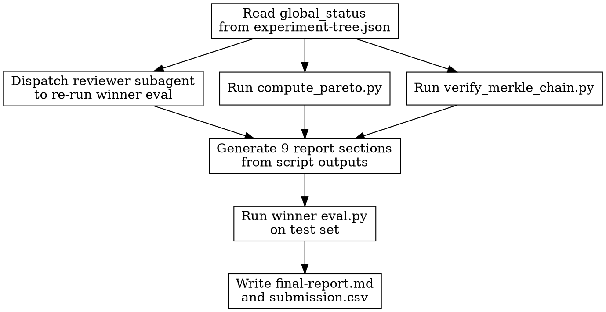

<!-- design-region-clean-of-hard-gates -->

# Final Report

<HARD-GATE>
Do NOT produce a final report unless global_status in experiment-tree.json is CONVERGED. STOP and return BLOCKED.
</HARD-GATE>

<HARD-GATE>
Do NOT cite a metric value without an executed script producing that value. NEVER state improvement percentages from mental arithmetic.
</HARD-GATE>

## Anti-Pattern

**"The best model achieved good performance"** -- "good" is not a number. The report must state the metric name, the winner's value, the baseline value, the absolute improvement, the relative improvement percentage, and the script that produced each number.

## Core Principle

Every claim in the report is anchored to a specific stdout line from an executed script.

## Process Flow



## Checklist

1. Verify global_status is CONVERGED
2. Dispatch reviewer subagent to re-run winner metrics
3. Run compute_pareto.py for the final Pareto front
4. Run verify_merkle_chain.py for integrity verification
5. Generate the 9 report sections from executed script outputs
6. Run winner eval.py on the test set to produce submission.csv
7. Write final-report.md and submission.csv to .auto-trainer/

## Step Details

### 1. Verify Global Status

Load .auto-trainer/experiment-tree.json and read global_status. If it reads EXPLORING, return BLOCKED immediately. Enumerate all nodes, their lineage, and their statuses.

### 2. Dispatch Reviewer Subagent

At least one independent reviewer verifies the winner's metrics by re-running its eval.py in the winner's worktree. The reviewer's output is included in the Integrity Summary section.

### 3. Compute Final Pareto Front

Execute compute_pareto.py to get the final Pareto front. Capture stdout for evidence.

### 4. Verify Merkle Chain

Execute verify_merkle_chain.py to confirm no tampering. Capture stdout for the Integrity Summary section.

### 5. Generate Report Sections

Write each of the 9 sections using only executed script outputs as evidence sources:

**Section 1 -- Objective Recap:** Dataset paths, target column, competition metric, metric direction. Taken from the objective YAML.

**Section 2 -- Data Quality Summary:** Findings from the data-validate skill: row counts, missing value rates, class distribution, feature types. Reference the validation script outputs.

**Section 3 -- Exploration Summary:** Total variants tried, tree depth reached, architecture classes explored, total wall-clock time, number of exploration rounds.

**Section 4 -- Pareto Front Evolution:** How the Pareto front moved across rounds. Show the pareto_history from the tree: which variants entered and exited the front at each iteration.

**Section 5 -- Winner Analysis:** The recommended variant with full evidence: metric value, config hash, parent lineage, architecture class, hyperparameters, training time. All from executed scripts.

**Section 6 -- Runner-up Comparison:** Top 3 variants from the final Pareto front. For each: metric value, parameter count, architecture class. A comparison table showing why the winner was selected.

**Section 7 -- Two-Tier Convergence Evidence:** Per-class exhaustion status from check_class_exhaustion.py output. Cross-class conditions from check_cross_class_coverage.py output. Which condition triggered convergence for each class.

**Section 8 -- Integrity Summary:** Merkle chain verification result from verify_merkle_chain.py. Reviewer subagent's independent metric verification. Any discrepancies flagged.

**Section 9 -- Reproducibility:** Exact worktree path of the winner. Full config JSON. Commands to reproduce: the git worktree checkout, the training command, the evaluation command.

### 6. Generate Kaggle Submission

Identify the winner's worktree path and eval.py script. Run eval.py on the test dataset specified in the objective. Validate the output: must contain the id_column and prediction_column specified in submission_format. Write submission.csv to .auto-trainer/submission.csv.

### 7. Write Output Files

Write .auto-trainer/final-report.md with all 9 sections. Write .auto-trainer/submission.csv with the validated Kaggle submission.

## Gate Functions

- BEFORE writing any metric into the report: "Which script produced this number and what was the stdout line?"
- BEFORE declaring a winner: "Did compute_pareto.py rank this variant first?"
- BEFORE writing submission.csv: "Did eval.py run on the test set and produce valid output format?"
- BEFORE marking DONE: "Has the reviewer subagent independently verified the winner's metrics?"

## Rationalization Table

| You think... | Reality |
|---|---|
| I can read the metric from the JSON file | Run a script that loads, computes, and prints to stdout. |
| The improvement is obviously 5% | Run a comparison script and capture the printed percentage. |
| The Pareto front is clear from the tree | Run compute_pareto.py and use its stdout. |
| The merkle chain is fine since nothing changed | Run verify_merkle_chain.py and capture the result. |

## Red Flags

- "achieved good performance"
- "significant improvement"
- "the metric from the JSON shows"
- "around X% better"
- "based on the numbers in the file"

## Key Principles

- Every number in the report traces to a specific script's stdout
- The reviewer subagent is independent and re-runs evaluation from scratch
- The Kaggle submission comes from the winner's eval.py on the test set, not from training outputs
- The report is the audit trail of the entire exploration, not a summary written from memory
- Nine sections cover the full lifecycle from objective to reproducibility

## The Bottom Line

```bash
echo "VERDICT: produce the report from executed script outputs, generate submission.csv from the winner eval run -- DONE or BLOCKED"
```

## Status Vocabulary

- **DONE** -- report delivered, submission.csv generated, winner identified with full evidence
- **DONE_WITH_CONCERNS** -- report delivered but integrity verification flagged discrepancies or reviewer disagreed on metrics
- **BLOCKED** -- cannot produce report (global_status not CONVERGED, all experiments crashed, tree is empty)
