<!-- design-region-clean-of-hard-gates -->

# Review Strategy

<HARD-GATE>
Do NOT read BUILD_REPORT.md or experiment-tree.json unless the dispatch prompt omits a required value. STOP and use the trainable_params and experiment history from the dispatch prompt.
</HARD-GATE>

<HARD-GATE>
Do NOT estimate complexity by reading model code unless no params are supplied. STOP and compute param_ratio from the inline numbers.
</HARD-GATE>

## Anti-Pattern

**"Let me read the model to estimate its complexity"** -- trainable_params for both the variant and baseline are in the dispatch prompt as integers. Compute param_ratio from those numbers.

## Core Principle

Compute complexity ratios, check Pareto dominance, and detect stale tuning using only the numbers provided inline in the dispatch prompt.

## Process Flow

```dot
digraph review_strategy {
  rankdir=LR;
  node [shape=box];
  read_inputs [label="Read Inline Context"];
  complexity [label="Compute Complexity Ratio"];
  lineage [label="Classify Lineage"];
  pareto [label="Check Pareto Dominance"];
  decision [label="Apply Decision Matrix"];
  emit [label="Write REVIEW.json"];
  read_inputs -> complexity -> lineage -> pareto -> decision -> emit;
}
```



## Checklist

1. Read evaluation_result, variant_params, baseline_params, experiment_history, and complexity_thresholds from the dispatch prompt.
2. Compute param_ratio and efficiency from the inline integers.
3. Classify each lineage change and count consecutive HP-only changes.
4. Check Pareto dominance against the inline experiment_history array.
5. Apply the decision matrix and select the verdict.
6. Write REVIEW.json to the variant worktree.

## Step Details

### 1. Read Inline Context

Read these values from the dispatch prompt:

- `evaluation_result` -- holds the verdict and `relative_metric_improvement`.
- `variant_params` -- the variant's trainable_params as an integer.
- `baseline_params` -- the baseline's trainable_params as an integer.
- `experiment_history` -- the array of prior nodes with their config_delta keys and metrics, including the current Pareto front.
- `complexity_thresholds` -- the efficiency and param_ratio cutoffs.

The orchestrator extracts every value before dispatch. Use the inline numbers.

### 2. Compute Complexity Ratio

Compute from the inline integers:

- `param_ratio = variant_params / baseline_params`
- `efficiency = relative_metric_improvement / param_ratio`

Thresholds:

| Efficiency | param_ratio | Verdict |
|---|---|---|
| > 0.5 | any | Worth it |
| 0.1 -- 0.5 | < 5.0 | Worth it |
| 0.1 -- 0.5 | >= 5.0 | Diminishing returns |
| < 0.1 | any | Not worth it |

Simplification special case: when `param_ratio < 1.0` and the primary metric does not degrade beyond the significance threshold, the verdict is Worth it regardless of efficiency.

### 3. Classify Lineage and Detect Stale Tuning

Classify each change in the variant's lineage from the inline experiment_history:

- **Architecture change:** config_delta key is `model_type`, `architecture_class`, `layer_config`, `feature_engineering`, or introduces a structural change.
- **HP-only change:** config_delta key is `learning_rate`, `batch_size`, `epochs`, `dropout`, `regularization`, `weight_decay`, or any purely numerical tuning knob.

Count consecutive HP-only changes from the current node backward. When the count exceeds 3, flag a stale tuning loop.

### 4. Check Pareto Dominance

Compare the variant's metrics against the Pareto front in the inline experiment_history array:

- **Dominant:** variant is better on at least one objective and no worse on the other. Add to the front, remove dominated points.
- **Dominated:** variant is worse on at least one objective and no better on the other. The variant does not join the front.
- **Neutral:** variant ties or trades off across objectives. Add to the front as non-dominated.

### 5. Apply Decision Matrix

| Complexity | HP Balance | Pareto | Verdict |
|---|---|---|---|
| Worth it | Not stale | Dominant or Neutral | KEEP |
| Worth it | Not stale | Dominated | KEEP_WITH_CONCERNS |
| Worth it | Stale (>3 HP-only) | Dominant | KEEP_WITH_CONCERNS |
| Worth it | Stale (>3 HP-only) | Neutral or Dominated | DISCARD |
| Diminishing | Not stale | Dominant | KEEP_WITH_CONCERNS |
| Diminishing | any | Neutral or Dominated | DISCARD |
| Not worth it | any | any | DISCARD |

### 6. Write REVIEW.json

Write the review result to `.auto-trainer/worktrees/<node-sha>/REVIEW.json`:

```json
{
  "node_sha": "abc123...",
  "verdict": "KEEP",
  "complexity": {
    "variant_params": 15200,
    "baseline_params": 12000,
    "param_ratio": 1.267,
    "relative_metric_improvement": 0.101,
    "efficiency": 0.0797,
    "complexity_verdict": "Worth it"
  },
  "hp_balance": {
    "lineage_length": 4,
    "consecutive_hp_only": 1,
    "stale": false
  },
  "pareto": {
    "status": "dominant",
    "front_updated": true,
    "points_removed": ["def456..."]
  }
}
```

## Gate Functions

- BEFORE computing param_ratio: "Am I using variant_params and baseline_params from the dispatch prompt, not from BUILD_REPORT.md?"
- BEFORE checking Pareto dominance: "Am I using the experiment_history array from the dispatch prompt, not from experiment-tree.json?"
- BEFORE flagging stale tuning: "Did I count consecutive HP-only changes from the inline experiment_history?"

## Rationalization Table

| You think... | Reality |
|---|---|
| "The metric improved so the variant is worth keeping" | Run the efficiency calculation against complexity because raw improvement ignores resource cost. |
| "The model looks simple enough" | Use variant_params and baseline_params to derive param_ratio because visual assessment is unreliable. |
| "One more HP tweak will get us there" | Check consecutive HP-only changes because stale tuning loops waste exploration budget. |
| "This variant dominates the front" | Check dominance against the inline Pareto front because multi-objective comparison requires formal computation. |
| "Let me read the experiment tree for the full history" | Use the experiment_history array from the dispatch prompt -- the orchestrator already extracted it. |

## Red Flags

- "The model is better so we keep it"
- "I can tell the complexity is fine from the architecture"
- "Just one more learning rate adjustment"
- "This is clearly Pareto-dominant"

## Key Principles

- Performance gain must be proportional to added complexity.
- Stale tuning loops (>3 consecutive HP-only changes) signal exhausted exploration directions.
- Pareto dominance is computed from inline numbers, not visually assessed.
- Simpler variants that maintain performance always earn their place.
- Strategic review is the last gate before a variant enters the experiment tree.

## The Bottom Line

```bash
echo "VERDICT: improvement must justify complexity, computed from inline numbers, verified by Pareto dominance"
```

## Status Vocabulary

- **KEEP** -- variant earns its place on merit, complexity, and strategic position
- **DISCARD** -- variant does not justify its complexity or is strategically redundant
- **KEEP_WITH_CONCERNS** -- variant is kept but with flagged issues (stale tuning, diminishing returns)
