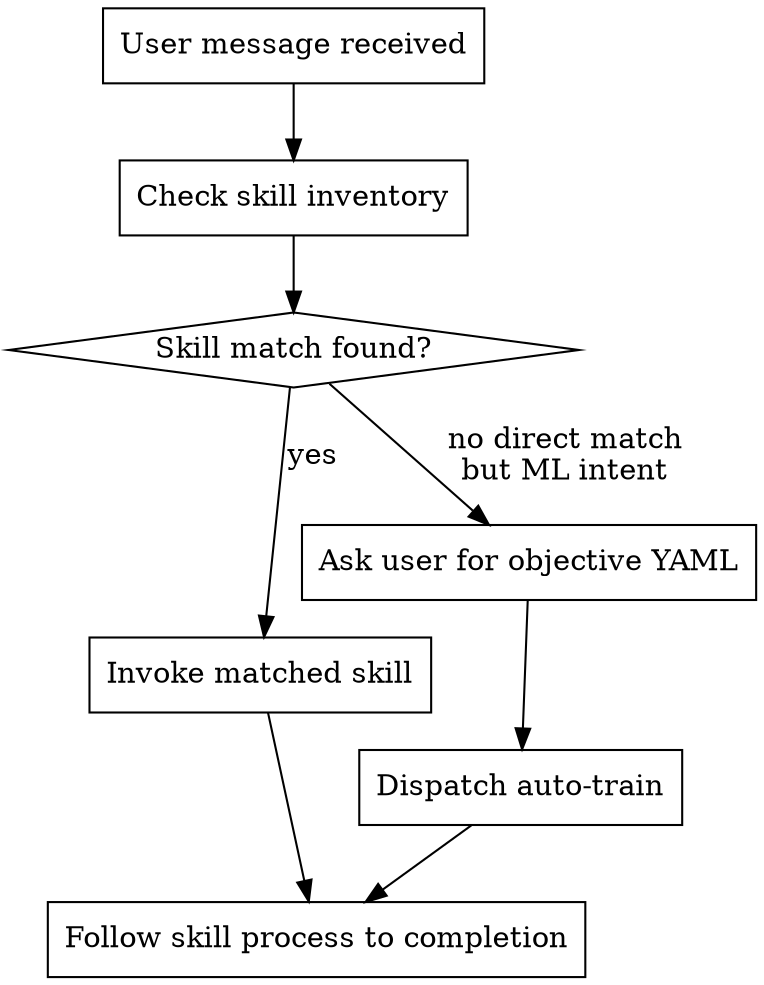

<!-- design-region-clean-of-hard-gates -->

# Using Auto Model Trainer

<HARD-GATE>
Do NOT begin any ML training work without first checking if a specialized capability applies. STOP and consult the inventory.
</HARD-GATE>

<HARD-GATE>
Do NOT invoke auto-train without a structured objective YAML file. STOP and ask the user for the objective.
</HARD-GATE>

<HARD-GATE>
Do NOT evaluate experiment results without dispatching evaluate. NEVER read metric values from output and compare them in natural language.
</HARD-GATE>

## Anti-Pattern

**"I can start training without checking the inventory"** -- bypassing the inventory leads to ad-hoc implementations that ignore Merkle lineage, two-tier convergence, and structural distrust. Every ML task maps to a capability; find it first.

## Core Principle

Route every ML training intent through the capability inventory before taking any action, so that autonomous convergence, Merkle lineage, and structural distrust are enforced from the first step.

## Process Flow



## Checklist

1. Detect ML intent in the user message
2. Match intent to a skill in the inventory
3. Invoke the matched skill with required context
4. Follow the matched process through to its terminal status

## Step Details

### 1. Detect ML Intent

Scan the user message for ML-relevant signals: mentions of datasets, training, models, Kaggle, experiments, hyperparameters, architectures, or evaluation metrics. If no ML intent is detected, exit -- the plugin does not apply.

### 2. Match Intent to Skill

Consult the inventory below. Each entry has a trigger condition. Match the user intent to the most specific capability available.

| Skill | Execution context | Context passed |
|---|---|---|
| auto-train | User sets an ML objective, mentions Kaggle, or wants autonomous training | Objective YAML and dataset paths |
| data-validate | Dispatched by auto-train before any modeling begins | Dataset paths and target column |
| feature-engineer | Dispatched by auto-train after data-validate | Validated dataset and feature manifest |
| baseline | Dispatched by auto-train after data validation passes | Locked feature set and metric definition |
| explore | Dispatched by auto-train after baseline | Pareto front and experiment history |
| build-variant | Dispatched as Task subagent by auto-train | Inline spec + resolved config |
| evaluate | Dispatched as Task subagent by auto-train | Inline manifest + baseline metrics |
| review-strategy | Dispatched as Task subagent by auto-train | Inline numbers only |
| converge | Dispatched by auto-train after each exploration round | Experiment tree and Pareto history |
| ensemble | Reference doc (orchestrator runs script directly) | Not invoked |
| final-report | Dispatched when converge returns CONVERGED | Full experiment lineage and winner |
| using-auto-model-trainer | Session start | Bootstrap skill loaded automatically |

### 3. Invoke the Matched Skill

Load the matched SKILL.md and follow its HARD-GATEs and process flow. Pass the objective YAML and any dataset paths as context.

**Objective File Format:**

```yaml
dataset:
  train: data/train.csv
  test: data/test.csv
  target: SalePrice
  id_column: Id

competition:
  name: house-prices-advanced-regression-techniques
  metric: RMSE
  direction: minimize
  submission_format: data/sample_submission.csv

constraints:
  max_experiments: 50
  max_wall_time_hours: 4
  architecture_classes_minimum: 3
  pareto_stability_rounds: 3
```

### 4. Follow the Matched Process

Run the matched workflow end-to-end:

1. **Validate objective** -- parse `objective.yaml`, confirm dataset path exists, target variable is named, and success metric is defined. If anything is missing, emit NEEDS_CONTEXT and stop.
2. **Register Stop hook** -- install the command-type Stop hook (`hooks/stop-hook.json`) that runs `check_convergence.sh` before every assistant turn ends.
3. **Data validation** -- dispatch `data-validate`. If it returns BLOCKED after autonomous mitigation attempts, surface the issue and stop. If DONE or DONE_WITH_CONCERNS, proceed.
4. **Feature engineering** -- dispatch `feature-engineer` to research and lock the feature set. It writes features.py and feature-manifest.json at `.auto-trainer/`. If BLOCKED, surface the issue and stop.
5. **Baseline** -- dispatch `baseline` to establish exp_000. This initializes the experiment tree, Pareto front, and Pareto history.
6. **Exploration rounds** -- auto-train fans out `build-variant`, `evaluate`, and `review-strategy` as Task subagents. Each subagent receives an inline context payload and returns its result to the orchestrator. Each round produces new nodes in the experiment tree. The Stop hook fires after each round, running `check_convergence.sh` to determine whether to continue exploring or declare convergence.
7. **Convergence** -- when `check_convergence.sh` returns CONVERGED (all classes exhausted, minimum class diversity met, Pareto front stable), the system stops exploring.
8. **Ensemble** -- the orchestrator runs `caruana_ensemble.py` directly to blend Pareto-front models via greedy selection, with no subagent dispatch. It runs before the final report.
9. **Final report** -- dispatch `final-report` to produce the comprehensive evidence-based report with the recommended solution, full experiment lineage, and Kaggle submission if applicable.

**Autonomous Execution Model:**

The Stop hook (`hooks/stop-hook.json`) runs `check_convergence.sh` before every assistant turn ends. The script:

1. Verifies Merkle chain integrity (BLOCKED_TAMPER if broken)
2. Recomputes the Pareto front via `compute_pareto.py`
3. Checks per-class exhaustion via `check_class_exhaustion.py`
4. Checks cross-class coverage via `check_cross_class_coverage.py`
5. Returns a JSON decision: either CONVERGED (stop) or EXPLORING with reasons (continue)

When the hook returns `{"decision": "block", "reason": "EXPLORING: ..."}`, the assistant receives the block and continues with the subsequent exploration round. When it returns CONVERGED, the assistant produces the final report.

**Two-Tier Convergence:**

Tier 1 -- Within-Class Exhaustion: Each architecture class (e.g., linear, tree, neural) is tracked independently. A class is marked EXHAUSTED when diminishing returns fall below 1% relative improvement across the last 2 depth levels AND depth >= 2, or the entire class is Pareto-dominated by another class AND depth >= 1.

Tier 2 -- Cross-Class Convergence: Global convergence requires (a) number of explored classes >= `architecture_classes_minimum`, (b) no class still in EXPLORING status, and (c) Pareto front unchanged for `pareto_stability_rounds` consecutive snapshots.

Mandatory Divergence: If only one architecture class has been explored, the system MUST explore at least `architecture_classes_minimum` classes before convergence is possible. Cross-class convergence condition (a) enforces this structurally.

## Gate Functions

- BEFORE starting any training work: "Have I checked the inventory for a matching capability?"
- BEFORE proposing an architecture or hyperparameter change: "Am I dispatching build-variant in an isolated worktree with Merkle lineage?"
- BEFORE evaluating any experiment result: "Am I running an executed script via the evaluate skill, not reading numbers from output?"
- BEFORE declaring convergence or completion: "Did check_convergence.sh return CONVERGED, or am I substituting my own judgment?"
- BEFORE producing a final report: "Have all convergence conditions been met mechanically, with Merkle chain integrity verified?"

## Rationalization Table

| You think... | Reality |
|---|---|
| "I know enough ML to skip the inventory lookup" | Check the inventory first because it enforces Merkle lineage and two-tier convergence that ad-hoc work misses. |
| "I can compare these metrics by reading the output" | Run a comparison script because natural language comparison introduces rounding and selection bias. |
| "One architecture class performed well, so I can stop early" | Enforce mandatory divergence because single-class convergence is structurally blocked for a reason. |
| "The convergence check is overhead I can skip" | Run check_convergence.sh because the mechanical check prevents premature stopping that judgment calls miss. |

## Red Flags

- "started training without loading a skill"
- "compared metrics by reading the numbers"
- "skipped data validation to save time"
- "declared convergence without running the script"
- "built a variant outside a worktree"
- "evaluated my own variant output"

## Key Principles

- **Execute, Don't Eyeball** -- never compare metric values in natural language. Write a script, execute it, read the output. All numerical comparisons via executed Python scripts.
- **Autonomous by Default** -- human intervention only at objective-setting and final approval. The system decides explore vs exploit. No intermediate gates.
- **Structural Distrust** -- no agent both produces and approves its own work. The builder does not evaluate. The evaluator does not decide what to build afterward.
- **Merkle Lineage** -- every experiment node's identity is `SHA-256(config_hash || parent_node_hash)`. The experiment tree is append-only and tamper-evident. `verify_merkle_chain.py` checks integrity before every convergence decision.
- **Explore then Exploit** -- breadth-first discovery across architecture classes, depth-first refinement within a class, Pareto-guided pruning of dominated paths.
- **Mandatory Divergence** -- the system must explore a minimum number of distinct architecture classes before convergence is allowed. One-class convergence is structurally impossible.
- **Compaction-Proof** -- all evidence (metrics, configs, lineage hashes) is written to disk in JSON files under `.auto-trainer/`. The experiment tree survives context window compaction because the scripts re-read from disk every time.
- **Mechanical Convergence** -- convergence is decided by executed scripts (`check_convergence.sh`), not by the assistant's judgment. The assistant cannot declare convergence; only the scripts can.

**Model Trainer vs Auto Model Trainer:**

| Aspect | Model Trainer | Auto Model Trainer |
|---|---|---|
| Structure | Linear pipeline with 5 stage gates | Single entry point, autonomous exploration tree |
| Human gates | Hypothesis, plan, report approval | Objective-setting, final approval only |
| Experiment model | One experiment at a time per batch | Experiment tree with parallel variant exploration |
| SHA fingerprints | Linear chain | Merkle tree of branching paths |
| Training flow | Batched training with wave dispatch | Continuous exploration rounds until convergence |
| Convergence | Human decides when to stop | Two-tier mechanical convergence via executed scripts |

**Status Vocabulary:**

| Status | Meaning |
|---|---|
| DONE | Stage complete, proceed |
| DONE_WITH_CONCERNS | Complete but flagged issues |
| BLOCKED | Cannot proceed, needs human input or unfixable error |
| BLOCKED_TAMPER | Merkle chain integrity check failed |
| BLOCKED_BUILD | Variant build failed, worktree artifacts missing |
| NEEDS_CONTEXT | Missing information, ask before continuing |
| EXPLORING | Experiment tree is still being expanded |
| CONVERGED | All convergence conditions met, ready for final report |
| EXHAUSTED | Architecture class has diminishing returns or is Pareto-dominated |
| DOMINATED | Experiment node is Pareto-dominated by another node |
| UNTRIED | Architecture class has no completed experiments yet |
| ACCEPT | Review or validation passed |
| REJECT | Review or validation failed |
| INCONCLUSIVE | Review or validation failed to determine a verdict |
| KEEP | Variant retained on the Pareto front |
| DISCARD | Variant pruned from further exploration |
| KEEP_WITH_CONCERNS | Variant retained but with flagged issues |

## The Bottom Line

```bash
echo "VERDICT: DONE -- bootstrap skill loaded, skill inventory active, route all ML intent through inventory before acting"
```
